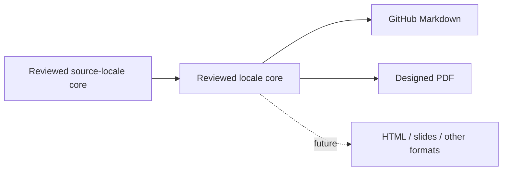

# Kungfu Publications

Source-owned, multilingual publications about reliable agent-assisted work.
Each publication has one reviewed content core per locale and two initial
projections:

- Markdown for direct reading on GitHub;
- PDF for download, sharing, printing, and offline reading.

The architecture keeps format and language separate:



Translations are not considered published merely because a machine produced
them. A locale becomes public only after its core is reviewed and its Markdown
and PDF projections pass the repository checks.

## Publications

| Publication | Markdown | PDF |
| --- | --- | --- |
| Atlas Lite: Obsidian + Hermes Agent multi-agent workflow | [简体中文](docs/zh-CN/atlas-lite-obsidian-hermes.md) | [Download](https://github.com/kungfu-systems/site-kungfu-publications/releases/latest/download/atlas-lite-obsidian-hermes-multi-agent-workflow-zh-CN.pdf) |
| Atlas Lite working method introduction | [简体中文](docs/zh-CN/atlas-lite-introduction.md) | [Download](https://github.com/kungfu-systems/site-kungfu-publications/releases/latest/download/atlas-lite-working-method-introduction-zh-CN.pdf) |

English and additional locales are planned but are not presented as reviewed
translations yet.

## Repository Model

```text
catalog.json                       publication and locale registry
content/<publication>/core/       reviewed content cores by locale
docs/<locale>/                     generated Markdown projections
design-system/                     shared tokens, templates, fonts, and SVG assets
scripts/                           projection builders and checks
_build/pdf/                        generated PDF projections, not committed
```

`content/` is authoritative. Files under `docs/<locale>/` are generated and
must not be edited directly. PDF files are distributed as GitHub Release assets
instead of being accumulated in Git history.

## Build

Markdown generation uses the Python standard library:

```sh
make md
make check
```

The reusable visual system is source-owned in
[`design-system/`](design-system/). Its JSON tokens generate the shared LaTeX
style used by every current PDF renderer, while the templates and SVG material
pack are directly reusable by future publications:

```sh
make design
make design-check
```

PDF generation requires Python 3 and
[Tectonic](https://tectonic-typesetting.github.io/):

```sh
make pdf
make all
```

See [`CONTRIBUTING.md`](CONTRIBUTING.md) for adding publications or locales and
[`docs/MAP.md`](docs/MAP.md) for repository navigation.

Publisher: Kungfu Origin Technology Limited.
