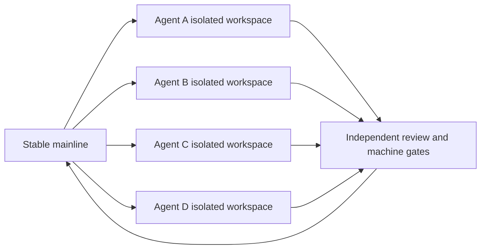
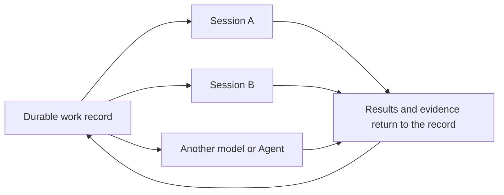
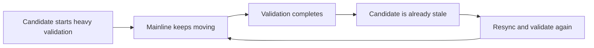
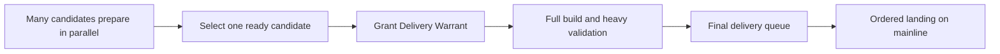
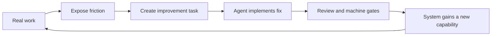

# Reliable Agent Workflow, 30 Days, 4,000 Pull Requests

> From million-line software engineering to a small business with millions in revenue: why the most important thing in the Agent era is not the Agent, but the work

## The whole story first

More than 4,000 pull requests in 30 days.

They were created inside a real, million-line, multilingual software system spanning runtimes, desktop applications, SDKs, builds, and releases. There was no vast engineering department behind them. There was one person, working with multiple Agents.

Those Agents could modify the same large project without overwriting one another, continue across sessions, models, and machines, and submit candidates at high speed. But they could not declare their own work complete. Every result crossed independent review and machine-enforced gates.

Soon we reached a problem ordinary teams almost never encounter: the mainline was moving so fast that candidates requiring heavy validation could never catch it. That pressure forced us to create the Delivery Warrant, a time-limited runway clearance that lets Agents keep producing while one candidate completes validation.

Four thousand pull requests in 30 days did not come from a model ten times smarter or a magical prompt. Throughput changed when we stopped treating Agents as chat assistants and organized them around work.

Now look at a completely different company.

It is a video content business with fewer than ten people and annual revenue in the millions. The owner interviews clients, decides positioning, reviews scripts, approves case studies, and uses publishing data to decide what happens next.

He does not lack an Agent that can write copy. The burden is the company's reality: what each client sells, which claims are verified, which cases can be published, which version is current, who is doing what, and what comes next.

If the Agent remains a chat tool, every new session, model, or Agent requires another explanation. More Agents turn the owner into their context manager.

The developer and the video business owner appear to have nothing in common, yet the same problem limits both: Agents can execute, but work has no durable digital form that other Agents can inherit, verify, and continue.

We call the infrastructure that lets work itself persist a Work Runtime.

Agents can change. Models can improve. Sessions can end. Work does not return to zero. Its facts, history, versions, responsibilities, authorities, and evidence form its Work State.

Chat history records what we said. Work State records what reality is now.

The first makes an Agent easier to talk to. The second lets a human entrust long-running work to Agents.

This is one of the most overlooked user assets of the Agent era. Models and Agents will be replaced. The working world accumulated by a person or business will remain.

This article explains how 4,000 pull requests in 30 days led us to a Work-centered method of organization, and why the same method can become essential Agent infrastructure for individuals and small businesses.

---

## Two worlds, one bottleneck

Software development and a video business use completely different tools, yet they face almost the same organizational problem.

| Software development | Video content business | What the system must answer |
| --- | --- | --- |
| Code, branches, and mainline | Clients, footage, and products | What reality is currently accepted |
| Pull request candidate | Video, script, or proposal | Which result is waiting for acceptance |
| Builds, tests, and review | Fact checking and client confirmation | Which evidence is trustworthy |
| Reviewer approval | Owner or client approval | Who can declare completion |
| Mainline version changes | Product, price, and permission changes | Whether an earlier judgment is still valid |
| Merge and release records | Publishing and client confirmation | Whether an action truly happened |

When this information exists only in chats, files, and human memory, the developer or owner becomes the context bus for the entire system.

With one Agent, the burden is easy to miss. With three, the human starts carrying context back and forth. With ten, the human becomes the busiest component: explaining the current version, every relevant change, what cannot be touched, what completion means, and whether an Agent's summary can be trusted.

Real multi-Agent work does not begin by adding more Agents.

It begins by removing the human from between them and letting every Agent work around the same durable Work.

## What must persist in the Agent era

The video business owner should not have to learn infrastructure vocabulary. The system should remember what still lives inside the owner's head.

> **Work is the durable effort. The Work Runtime organizes and advances it. Work State is the data asset accumulated as the work continues.**

More concretely, every long-running effort must answer six basic questions:

- Which Work is this?
- What is true now?
- What happened, and why did the current situation emerge?
- Which version of reality supports the current judgment?
- Who is responsible, and who has authority to approve?
- Which actions actually happened, and what evidence remains?

Together, these questions form the digital skeleton of work. We can call them work primitives, or ignore the names entirely. What matters is that the system can answer them precisely.

Natural language is excellent for explaining state. It should not be the only authority for state.

An Agent saying that tests passed does not prove they ran. An Agent saying that the client agreed does not prove the client approved public release. An Agent saying that a task is complete does not mean the result was accepted. A judgment that was correct yesterday may no longer be correct after reality changes.

That is why the next Agent cannot merely read a summary left by the previous one.

Real handoff does not inherit somebody's narrative about the work. It inherits the same Work: the objective still exists, current facts can be inspected, change history can be traced, responsibility and authority are explicit, real actions have evidence, and unresolved problems cannot disappear behind a polished summary.

## Why Work State becomes a core data asset

Today, attention goes to the strongest model, the smartest Agent, and the framework with the most tools.

But models improve, Agents are replaced, and execution frameworks change. What must not disappear is the identity of the work, the current reality, how it changed, who may continue, and which results have been proven.

This accumulating information is Work State.

It is different from ordinary Agent memory. Memory is well suited to preferences, communication style, and durable knowledge. Work State preserves the operating reality of a person or business.

Its value grows with use. The system gradually learns how a client moved from first contact to purchase, which judgments once worked, which content created real outcomes, what evidence is trustworthy, which processes fail, and when a human decision is mandatory.

This is not a collection of chat logs waiting to be searched. It is organizational capability that can continue to execute.

Agents are replaceable labor. Work State is the compounding data asset the user actually owns.

## Why chat, memory, and automation are still not enough

Most Agent products people encounter today still begin with a Conversation, Session, or Project. They can preserve chats, reference files, remember preferences, call tools, run automation, and maintain more context inside a project.

These capabilities are valuable. They still do not automatically answer the six questions of Work.

Chat history records what was said, but does not automatically distinguish a client's claim, an Agent's inference, and a verified fact. Project knowledge provides context, but does not automatically state which version an approval covered. Automation can retry an action without necessarily knowing whether the real-world effect already happened. A task board can show who is assigned without knowing who has authority to make a result official.

What is missing is a layer between Agents, files, and business actions. It lets Work persist, organizes facts, history, versions, responsibility, authority, and evidence around that Work, and treats the current Agent as a replaceable executor.

That layer is the Work Runtime.

It is not a longer chat window. It is infrastructure that lets Agents enter an organization and carry real work over time.

## These well-known methods are strong, so why are they still not enough?

The KFD workflow is a Work-centered method of organizing Agents that grew out of real production inside Kungfu. Before introducing its concrete mechanisms, we need to distinguish it from well-known methods such as Superpowers, Spec Kit, OpenSpec, GSD, BMAD, and Ruflo.

These projects are far more than collections of prompts. Superpowers connects brainstorming, isolated workspaces, task planning, TDD, fresh implementing Agents, two-stage review, and verification before completion. Spec Kit can orchestrate specs, plans, tasks, and implementation as workflows that pause and resume. OpenSpec preserves specifications and changes as reviewable artifacts. GSD and BMAD carry project context across phases and organize parallel development. Ruflo coordinates large groups of Agents, memory, and swarms.

They answer an important question very well: **How can Agents perform software development more reliably?**

But even after installing all of them, a more fundamental problem remains. Which durable Work is this? What reality does the organization currently accept? Who has authority to change it? Did an action actually happen? Which version does a piece of evidence cover, and is it still valid? When high-speed candidates compete for one mainline, which candidate receives a delivery position?

Plans, specs, task lists, Agent memory, and workflow run state can preserve valuable information. They do not automatically become authority over organizational reality. A passing test proves that one candidate passed one test at one moment. It does not by itself decide whether that candidate still fits the current mainline. An Agent completing a plan does not mean the result has received independent acceptance or entered the real delivery surface.

> **These methods primarily organize how Agents work. The KFD workflow first organizes how Work itself persists, who may change it, what makes a result accepted, and how it safely enters reality.**

The KFD workflow therefore does not need to replace these methods. Superpowers, GSD, or BMAD can become an execution method inside the Work Runtime. What is missing is the layer below them: a durable, verifiable, deliverable Work that every method, model, and Agent can operate around.

## How we built a Work Runtime inside Kungfu

Kungfu did not begin with one grand diagram of a future architecture. We placed many Agents inside the real production of a million-line software system, then let every risk of losing control force the system to grow a new working capability.

Software engineering provided an unforgiving test site: files collide, sessions end, Agents make confident mistakes, mainline changes, validation expires, and a bad delivery can break the entire system.

The methods below are the concrete form of a Work Runtime under high-intensity software development.

### Give every task its own workspace

Multiple developers would not share one chair and type on one keyboard at the same time. Multiple Agents should not modify the same files in the same working directory either.

The KFD workflow creates an isolated workspace for every task. Every Agent begins from the same stable mainline, but modifies, tests, and experiments only inside its own space.

This sounds simple because it is simple. It is also the foundation of every form of safe parallelism that follows.

If one Agent fails, it leaves behind one failed candidate instead of corrupting everyone else's work. One Agent can perform a large refactor while another repairs documentation, adds tests, or investigates a new direction. Unfinished work stays inside its workspace. Only an accepted result is allowed to enter the shared mainline.

Parallel work is divided into two phases: production can be highly parallel, but delivery must happen in order.

Traditional teams achieve this separation through offices, roles, branches, and process. The KFD workflow compresses the same organizational ability into an environment Agents can use directly.

### Work cannot belong to one session

Chat history is useful for conversation. It is not a reliable long-term work record.

It can be cut by a context window, compressed by an automatic summary, altered by a product upgrade, or lose continuity when the model, account, device, or provider changes.

If a long-running task can exist only inside one session, that session still owns the work. The human must keep restoring everything the session forgot.

The KFD workflow moves work out of the session. Every task keeps a durable record of:

- why it exists;
- where the work currently stands;
- which attempts have already happened;
- which results have passed checks;
- which problems remain;
- what should happen next;
- which evidence is required for completion.

The session returns to the role it is actually good at: one opportunity to execute.

When one Agent leaves, another reads the same work record and continues. Work started by Codex can move to Claude. Work on a Mac can continue on Linux. A task paused today can resume next week.

What survives is not an ever-growing chat transcript. It is a preserved work site.

We do not require the Agent to remember forever. We let the work remember what happened.

### Writing the code and accepting the result must be separate

In chat-based development, the Agent often acts as both performer and judge.

It changes a few files, runs one command, and says, "The task is complete." If the human has no time to inspect the result, that sentence can easily become project reality.

In the KFD workflow, execution and acceptance are separate responsibilities.

The implementing Agent submits a candidate result together with its scope, validation method, known risks, and delivery evidence. A separate reviewer starts again from the original objective and asks whether the candidate solved the real problem, crossed a boundary, skipped an important check, or can safely enter the mainline.

The implementing Agent submits the exam. It does not grade its own paper.

Independent acceptance does not force a human back into reviewing every line. It moves repetitive judgments into machinery: whether file scope is correct, generated output is stale, tests actually ran, the version is exact, dependencies match, and delivery evidence is complete.

The human handles the decisions that machines cannot replace: direction, tradeoffs, taste, risk, and responsibility.

### Quality cannot remain a document people are expected to remember

Kungfu is not a small collection of web pages and scripts. It is a million-line, multilingual software system containing low-level runtimes, cross-language SDKs, desktop products, terminal tools, extensions, build chains, installers, and release systems.

In a codebase like this, a change that appears local can cross several languages, platforms, and delivery layers.

No person can remember every possible impact. Asking an Agent to behave carefully after reading a very long engineering guide is not enough when thousands of changes are moving in parallel.

Quality must become a set of rules the machine can execute:

- the machine identifies what changed;
- dependency relationships determine what may be affected;
- change scope selects the checks that must run;
- gates reject missing evidence;
- receipts bind successful validation to an exact version;
- a failed candidate cannot enter the mainline through a persuasive explanation.

Slow development can lean on human caution.

High-speed development must lean on machine-enforced institutions.

These gates are not process overhead attached to development. They are infrastructure that makes sustained speed possible. Without them, faster Agent production only creates disorder, defects, and rework faster.

## When complete validation can no longer catch the mainline

When our multi-Agent system began to work at full speed, we moved beyond the operating range assumed by traditional continuous integration.

Traditional CI relies on an unstated assumption: after a candidate starts validation, the mainline will remain nearby. When the build and tests complete, the candidate should need only a small update before it can land.

That assumption disappeared under Kungfu's throughput.

A change to the underlying runtime may require a full build, cross-module tests, SDK checks, and delivery validation. Those checks can take many minutes. During the same period, other Agents keep finishing tasks and the mainline keeps moving.

The candidate begins against mainline version A. Validation ends when the mainline is already at version D. It resyncs and starts again. When the second run finishes, the mainline has reached version G.

This is not an Agent capability problem. Buying more build machines cannot fully remove it. It is a structural conflict between production speed and validation speed.

Low-throughput teams worry that slow CI will block development.

We reached the point where development was so fast that CI could not find a stable moment to deliver.

## Delivery Warrant: reserve a runway for heavy validation

That pressure produced the Delivery Warrant. It can be understood as a delivery clearance or runway reservation.

An airport allows many aircraft to prepare, taxi, and wait at the same time. It does not allow them to occupy the same runway at once. High-speed software delivery needs the same kind of order.

Many Agents can continue developing, submitting candidates, and running lightweight checks. When one candidate is ready for expensive complete validation, the system gives it a time-limited delivery position bound to an exact identity. Later candidates cannot casually take that position away.

It changes four things.

### Expensive validation serves a definite candidate

The system does not let a dozen candidates that will soon become obsolete consume complete build capacity. Only a ready candidate with a warrant enters heavy validation.

### The candidate receives a delivery position it can reach

New work cannot jump ahead forever and make the completed validation meaningless the moment it ends.

### Validation evidence is bound to exact code

The warrant binds candidate code, current mainline, validation plan, and results. If the candidate is replaced, the warrant expires, execution is interrupted, or a real conflict appears, the system refuses to present the old evidence as current.

### Unrelated changes no longer destroy expensive evidence

If mainline changes do not overlap the candidate or its impact area, the system can determine that existing evidence still applies. If the same code is touched or the relationship is uncertain, the required checks run again.

The Delivery Warrant does not lower any quality standard.

It solves a harder problem: when development is faster than validation, how can one strict, expensive, complete validation run actually reach the mainline?

We did not merely need faster CI. We needed air traffic control for software delivery.

## Dogfood: let real production break the old workflow

The Delivery Warrant was not designed in a meeting room for some imagined future. It emerged because Kungfu uses its own work system to build itself every day.

This goes beyond the usual claim that a team uses its own product. Kungfu Dogfood refuses to hide missing system capabilities behind human coordination.

If workspaces collide, people should not have to remind each other to be careful. The system must create real isolation.

If an Agent forgets everything after one session, a project owner should not have to retell the story. The work must own a durable record.

If implementers keep declaring their own work complete, occasional manual inspection is not enough. The system must provide independent acceptance and machine gates.

If heavy validation cannot catch the mainline, the answer cannot be, "Everyone slow down." The delivery order must be redesigned.

Every time extreme throughput breaks the system, the break produces the next generation of working capability.

Four thousand pull requests in 30 days are therefore both an output of Kungfu and fuel for its continued evolution. Real work exposes real problems. Solving real problems increases the scale the next cycle can carry.

## Projecting software organization back into an ordinary business

Return to the video content company.

The owner should never have to see concepts such as Work, Fact, Cut, Authority, or Receipt. A bank customer does not understand database transactions, yet reasonably expects a transfer not to debit twice, a balance to survive a new phone, and every payment to remain traceable months later.

The Work Runtime should give the owner an extremely simple operating surface:

> You have two decisions to make today.
> Client A's new recording produced two claims that need confirmation.
> Video 17 uses a case whose permission was withdrawn, so it cannot be published.
> Client B has no blocker, and the Agents are preparing the next scripts.

The owner no longer retells client history to every Agent or remembers where dozens of pieces of content are blocked. The system knows which Work owns each item, what the current world is, which conclusions expired, which actions may continue, and which decisions require the owner.

Agents continue executing in the background. The Work Runtime presents only the few questions that require human judgment.

That is real load reduction. The owner does not become faster at replying to Agents. Work continues without depending on the owner to carry context between them.

Infrastructure complexity is justified only when it creates radical simplicity for the user.

## Where an ordinary developer can begin

You do not need to reproduce the entire Kungfu system. You do not need dozens of Agents on the first day.

The essential workflow can begin with three Agents and four rules.

### Rule one: every writing task gets an isolated workspace

Do not let two Agents modify files in the same working directory. Share a stable mainline and isolate production.

### Rule two: task state lives outside the session

At minimum, preserve the objective, scope, acceptance criteria, current state, result evidence, and next action. When another Agent takes over, it should read the work record instead of asking the human to repeat the story.

### Rule three: the implementer does not perform final acceptance

Assign an independent reviewer to important work. The reviewer should search for problems from the objective and actual result, not merely read the implementer's summary.

### Rule four: machine gates protect the shared mainline

Anything that can be verified automatically should not depend on a verbal promise. Only candidates that pass the applicable checks can become official results.

First make these four rules stable inside one real project. Then add more concurrency, automatic dispatch, execution across devices, and more sophisticated delivery warrants.

The important metric is not how many Agents you have on day one. It is whether adding one more Agent requires the same increase in human coordination.

## One person is no longer only one person

The deepest meaning of 4,000 pull requests in 30 days is not the volume of code submitted.

It is the appearance of a new unit of personal production.

It proves that work primitives and a Work Runtime can organize many Agents into a reliable software team. The video business story shows that the same problem exists across ordinary commercial organizations.

One person can organize many Agents for sustained development across a million-line software system, or prevent the clients, content, decisions, and execution of a small company from living entirely inside the owner's head. Work survives chat sessions. Execution is not tied to one vendor. Parallel work stays isolated. Completion requires more than self-declaration. Quality does not depend on manual inspection. Delivery does not lose order when production becomes extremely fast.

Agents provide execution.

Isolated workspaces provide parallelism.

Durable work records provide continuity.

Independent review provides trust.

Machine gates provide quality.

The Delivery Warrant provides order at high speed.

Dogfood keeps the entire system evolving.

Work State turns every completed effort into a user-owned data asset.

Most people are still learning how to chat with an Agent.

We have started solving the next problem: when Agents can truly work at scale, how do we organize them, accept their results, and move thousands of tasks through a million-line codebase or a continuously operating company while the entire system preserves direction, quality, and order?

That is the KFD workflow.

It is not a better chat interface.

Agents provide execution.

The Work Runtime provides organization.

Work State becomes the compounding digital asset the user truly owns.

## Appendix: a multi-dimensional comparison of the KFD workflow and mainstream Agent methods

This comparison does not rank the methods. It shows the layer each one serves. Widely adopted methods can become execution components inside the KFD workflow. The Work Runtime adds shared work authority, facts, acceptance, and delivery.

| Method | Core unit | Main guarantees | Upper-layer problem still unresolved |
| --- | --- | --- | --- |
| Superpowers | Design, plan, task, and branch | Isolated workspace, TDD, fresh Agents, two-stage review, verification, durable ledger | Portfolio work authority, admission of business facts, delivery position, organizational recovery |
| Spec Kit | Spec and workflow run | Structured artifacts, human gates, pause and resume, conditional and parallel orchestration | Workflow state is not organizational reality; action authority and fact admission are not default runtime capabilities |
| OpenSpec | Current specification and change | Agreement before implementation, with changes archived into the current specification | Responsibility, authority, action receipts, independent acceptance, high-speed multi-Agent delivery |
| GSD and BMAD | Project, milestone, phase, epic, and story | Durable context, phased planning, parallel execution, verification, shipping, retrospectives | One Work identity and authoritative state across tools, repositories, machines, and business domains |
| Ruflo and Ralph-style loops | Agent swarm or iterative task | Agent coordination, memory, fresh context, repetition, self-correction | The center remains the Agent or loop; reality, completion authority, and delivery authority need another system |
| KFD workflow | Durable Work and its WorkRef | Authoritative state, version cuts, action receipts, independent acceptance, machine gates, Delivery Warrant | Lets the methods above remain replaceable execution layers around one shared work reality |

## Continue exploring

- [Kungfu bootstrapping workflow and public evidence](https://kungfu.tech/about/bootstrapping/)
- [Public work sample and downloadable data](https://kungfu.tech/about/bootstrapping/evidence/)
- [Official KFD repository](https://github.com/kungfu-systems/kfd)
- [Kungfu Systems on GitHub](https://github.com/kungfu-systems)
- [Atlas Lite: Obsidian and Hermes Agent multi-Agent workflow (Chinese)](https://github.com/kungfu-systems/site-kungfu-publications/blob/main/docs/zh-CN/atlas-lite-obsidian-hermes.md)
- [Official Superpowers repository](https://github.com/obra/superpowers)
- [Official GitHub Spec Kit repository](https://github.com/github/spec-kit)
- [Official OpenSpec repository](https://github.com/Fission-AI/OpenSpec)
- [Official GSD Core repository](https://github.com/open-gsd/gsd-core)
- [Official BMAD Method repository](https://github.com/bmad-code-org/BMAD-METHOD)
- [Official Ruflo repository](https://github.com/ruvnet/ruflo)
- [Official ChatGPT Projects documentation](https://help.openai.com/en/articles/10169521-projects-in-chatgpt)
- [Official Claude Projects documentation](https://support.claude.com/en/articles/9517075-what-are-projects)
- [Official Hermes Agent Sessions documentation](https://hermes-agent.nousresearch.com/docs/user-guide/sessions/)
