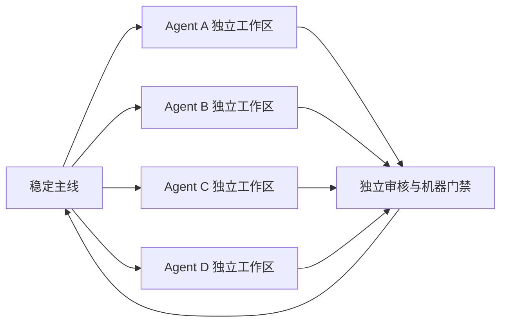
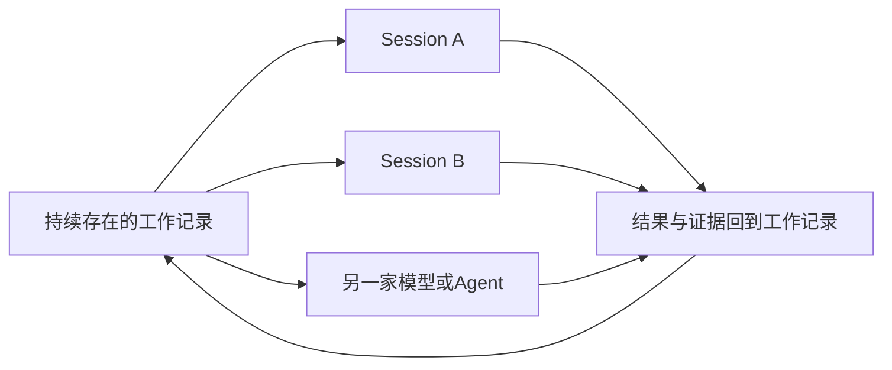
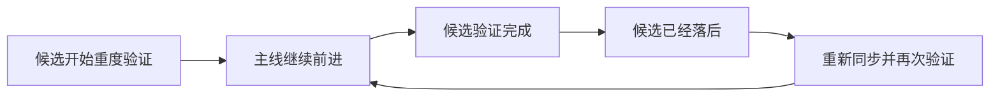
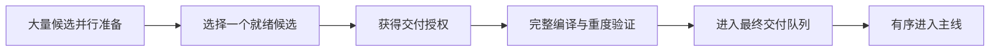
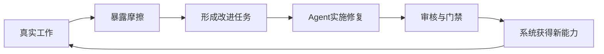

# Agent可靠工作法，30天，4000个PR

> 从百万级软件工程到千万流水小公司，为什么Agent时代最重要的不是Agent，而是工作本身

## 先把最精彩的故事讲完

30天，超过4000个PR。

它们发生在一个百万级、多语言、横跨运行时、桌面端、SDK、构建和发布系统的真实代码体系里。背后不是一支庞大团队，而是一个人，带着多个Agent。

这些Agent可以同时修改同一个大型项目而不互相覆盖，可以跨越Session、模型和机器继续工作，也不能自己宣布完成。每项结果都要经过独立审核和机器门禁。

很快，我们甚至遇到了一个普通团队几乎不会遇到的问题：主线前进得太快，带重度编译验证的候选永远追不上它。于是我们开发了Delivery Warrant，像一张有时限的跑道许可：大量Agent继续生产，系统为正在完整验证的候选保留交付位置。

30天4000个PR不是因为模型聪明十倍，也不是因为某种神奇Prompt。真正改变产能的，是我们不再把Agent当作聊天助手，而是用一套以工作为核心的系统组织它们。

现在把视线移到另一家公司。

这是一家不到十人的短视频公司，年流水几百万到几千万。老板采访客户、判断定位、审核脚本、确认案例，再根据发布数据决定下一步。

他不缺会写文案的Agent。真正压在他身上的，是公司的现实：客户卖什么，哪些事实已核实，哪些案例能公开，哪个版本有效，谁在做什么，下一步是什么。

如果Agent仍然只是聊天工具，每换一个Session、模型或Agent，老板就要重新解释一遍。Agent越多，他越像Agent的上下文管理员。

软件开发者和短视频老板看似毫无关系，却被同一个问题拖住：Agent可以执行，但工作本身没有能够长期存在、被不同Agent接力、验证和恢复的数字形态。

我们把这层让工作持续存在的基础设施称为工作运行系统（Work Runtime）。

Agent可以更换，模型可以升级，Session可以结束，但工作本身（Work）不会归零。围绕它积累的事实、历史、版本、责任、权限和证据，形成工作状态资产（Work State）。

聊天记录保存的是“我们说过什么”；工作状态保存的是“现实现在是什么”。

前者让Agent更好聊。后者才让人可以真正把长期工作交给Agent。

这正是Agent时代最容易被忽视的用户资产：模型和Agent会被替换，一个人或企业积累起来的工作世界却不会。

这篇文章要讲的，就是我们如何从30天4000个PR出发，建立一套以工作为中心的组织方法；以及为什么同一套方法，会成为个人和小型商业组织真正需要的Agent基础设施。

---

## 两个世界，同一个瓶颈

软件开发和短视频公司使用完全不同的工具，却面对几乎相同的组织问题。

| 软件开发现场 | 短视频公司现场 | 系统真正需要回答的问题 |
| --- | --- | --- |
| 代码、分支和主线 | 客户、素材和产品 | 当前被承认的现实是什么 |
| PR候选 | 视频、脚本和方案 | 哪个结果正在等待验收 |
| 编译、测试和审查 | 事实核验和客户确认 | 什么证据足够可信 |
| Reviewer批准 | 老板或客户批准 | 谁有权宣布完成 |
| 主线版本变化 | 产品、价格和授权变化 | 旧判断现在是否仍然有效 |
| 合并与发布记录 | 内容发布和客户确认 | 动作是否真正发生 |

当这些信息只存在于聊天、文件和人的记忆里，老板或开发者就会成为整个系统的上下文总线。

一个Agent时，这种负担不明显。三个Agent时，人开始来回搬运背景。十个Agent时，人很快成为整套系统里最繁忙的组件：告诉每个Agent当前版本、已经发生的变化、哪些内容不能碰、什么才算完成，再判断它的总结是否可信。

所以真正的多Agent工作，第一步不是增加Agent数量。

而是把人从Agent之间拿掉，让所有Agent围绕同一份持续存在的Work协作。

## Agent时代真正需要长期保存的是什么

短视频老板不需要学习基础设施术语。他只需要系统替自己记住那些今天仍压在脑子里的事情。

> **Work是那份长期存在的工作。Work Runtime是组织和推进工作的系统。Work State是工作过程中不断积累的数据资产。**

具体来说，任何长期工作都逃不开六个基本问题：

- 这到底是哪一份工作？
- 现在什么是真的？
- 过去发生过什么，为什么会变成现在这样？
- 当前判断基于哪个版本的现实？
- 谁负责推进，谁有权批准？
- 哪些动作真正发生过，留下了什么证据？

这些问题共同构成工作的数字骨架。你可以把它们叫做工作原语，也可以完全不记这些名字。重要的是，系统必须能明确回答它们。

自然语言非常适合解释状态，却不适合独自充当权威状态。

Agent说“测试通过了”，不等于测试真的运行；Agent说“客户同意了”，不等于客户批准了公开发布；Agent说“任务完成了”，不等于结果已经验收；一个判断在昨天正确，也不等于现实变化后今天仍然有效。

这就是为什么我们不能只让下一个Agent阅读上一个Agent留下的一段总结。

真正的接力，不是继承别人对工作的叙述，而是接手同一份Work：目标仍然存在，当前事实可查，变化历史可追，责任和权限明确，已经发生的动作拥有证据，尚未解决的问题不会被一句漂亮的总结抹掉。

## 为什么工作状态会成为核心数据资产

今天，人们最关心哪个模型更强、哪个Agent更聪明、哪个框架拥有更多工具。

但模型会升级，Agent会被替换，执行框架会变化。真正不应该丢失的是：这份工作是谁、现实现在是什么、为什么变成这样、谁可以继续、哪些结果已经得到证明。

这些持续积累的信息就是工作状态。

它不同于普通Agent Memory。Memory更适合保存用户偏好、表达习惯和长期知识；工作状态保存的是一个人或一家企业当前正在运转的现实。

使用时间越长，它就越有价值。系统会逐渐知道一个客户如何从第一次见面走到成交，哪些判断曾经有效，哪些内容真正产生结果，什么样的证据足够可信，哪些流程容易失败，以及什么情况下必须让人做决定。

这不是一批等待搜索的聊天记录，而是一份可以继续执行的组织能力。

Agent是可以替换的劳动力。工作状态才是用户真正拥有、能够长期复利的数据资产。

## 为什么聊天、Memory和自动化仍然不够

今天，大多数人接触到的Agent产品，入口仍然是Conversation、Session或Project。它们已经可以保存聊天、引用文件、记住偏好、调用工具、运行自动化，甚至在一个项目中维持更长的上下文。

这些能力非常有价值，却仍然没有自动回答Work的六个问题。

聊天历史告诉Agent过去说过什么，不会自动区分客户自述、Agent推测和已经核实的事实。项目知识提供背景，不会自动表达某个批准针对哪个版本。自动化可以重试一个动作，却不一定知道这个动作是否已经在真实世界发生。任务看板显示谁在做什么，却不一定知道谁有权让结果成为正式业务现实。

真正缺少的是位于Agent、文件和业务动作之间的一层：它让工作持续存在，让事实、历史、版本、责任、权限和证据围绕工作组织起来，再把当前Agent当作可以随时更换的执行者。

这就是工作运行系统。

它不是另一个更长的聊天窗口，而是让Agent第一次能够进入组织、持续承担真实工作的基础设施。

## 这些知名工作法已经很好，为什么仍然不够

KFD工作法，是Kungfu在真实生产中长出来的一套以工作为核心的Agent组织方法。在介绍它的具体机制之前，必须先说清楚它与Superpowers、Spec Kit、OpenSpec、GSD、BMAD、Ruflo等知名方法的关系。

这些项目绝不是几套简单Prompt。Superpowers已经把构思、独立工作区、任务计划、TDD、新Agent执行、两阶段审查和完成前验证串成完整开发纪律；Spec Kit可以把Spec、计划、任务和实现编排成可暂停恢复的工作流；OpenSpec把规格和变更保存为可审查的长期文件；GSD和BMAD能够跨阶段保存项目上下文并组织并行开发；Ruflo则把大量Agent、记忆和Swarm组织起来。

它们已经很好地回答了一个重要问题：**怎样让Agent更可靠地完成软件开发。**

但即使把这些方法全部装上，另一个更根本的问题仍然存在：这究竟是哪一份长期工作？当前被组织承认的现实是什么？谁有权改变它？某个动作是否真的发生？一份证据对应哪个版本、现在是否仍然有效？多个高速候选争夺同一条主线时，谁获得交付位置？

计划、Spec、任务表、Agent Memory和工作流运行状态都可以保存重要信息，却不会自动成为组织现实的权威。一次测试通过可以证明某个候选在某个时刻通过了测试，却不能单独决定它是否仍适合当前主线；一个Agent完成了计划，也不等于结果已经被独立验收并真正进入交付面。

> **这些方法主要组织Agent怎样工作。KFD工作法首先组织工作本身怎样长期存在、由谁改变、依据什么被承认，以及怎样安全进入现实。**

因此，KFD工作法不是要替代这些方法。Superpowers、GSD或BMAD完全可以成为工作运行系统中的一种执行方法。真正缺失的是它们下面那一层：让所有方法、模型和Agent围绕同一份可恢复、可验证、可交付的Work运行。

## 我们怎样在Kungfu把工作运行系统做出来

Kungfu没有从一张宏大的未来架构图开始。我们先让大量Agent进入百万级软件系统的真实生产，再让每一次失控风险逼迫系统长出新的工作能力。

软件工程提供了极其严格的试验场：文件会冲突，Session会结束，Agent会自信地犯错，主线会变化，验证会过期，错误交付会直接破坏整个系统。

下面这些方法，就是工作运行系统在高强度软件开发中的具体形态。

### 给每项任务一张独立工作台

多个开发者不会坐在同一张椅子上、同时操作同一套键盘。多个Agent也不应该挤在同一个目录里修改同一批文件。

KFD工作法为每项任务建立独立工作区。每个Agent都从同一条稳定主线出发，却只在自己的空间里修改、测试和试错。

这件事看起来朴素，却是所有并行能力的地基。

一个Agent失败，只会留下一个失败的候选，不会污染其他人的现场。一个Agent进行大规模重构，另一个Agent仍然可以修复文档、补充测试或研究新的方向。半成品留在自己的工作区，只有通过验收的结果才有资格进入共同主线。

并行因此被分成两个不同阶段：生产可以高度并行，交付必须有序发生。

传统团队用办公室、岗位、分支和流程实现这种隔离。KFD工作法把同样的组织能力压缩成Agent可以直接使用的工作环境。

### 工作不能属于某一次Session

聊天记录很适合保存对话，却不是可靠的长期工作记录。

它可能被上下文窗口截断，被自动摘要压缩，被产品升级改变，也可能随着模型、账号、设备或供应商切换而失去连续性。

如果一项长期任务只能依赖某个Session继续存在，那么真正掌握任务的仍然是那个Session，以及负责不断补充背景的人。

KFD工作法把工作从Session里拿出来，为每项工作持续保存：

- 为什么要做；
- 当前做到哪里；
- 哪些尝试已经发生；
- 哪些结果已经通过检查；
- 还存在哪些问题；
- 下一步应该做什么；
- 最终完成需要哪些证据。

Session于是从“工作的容器”降回它真正适合的位置：一次执行机会。

一个Agent离开，另一个Agent读取同一份工作记录继续。Codex开始的工作可以交给Claude，Mac上的工作可以转移到Linux，今天没有完成的任务可以在下周恢复。

继承的不是一段越来越长的聊天，而是一个已经保存好的工作现场。

我们不要求Agent永远记住工作。我们让工作自己记住发生过什么。

### 写代码和宣布完成，必须分开

聊天式开发里，Agent往往同时扮演执行者和验收者。

它修改了几个文件，运行了一条命令，然后告诉你“任务已经完成”。如果人没有时间复查，这句话很容易直接变成项目现实。

在KFD工作法中，执行和验收是两项不同责任。

写代码的Agent负责提交候选结果，同时说明修改范围、验证方式、已知风险和交付证据。另一个审核者重新从原始目标出发，检查它是否解决了真正的问题，是否越过边界，是否遗漏关键验证，是否可以安全进入主线。

写代码的Agent负责交卷，但不能自己给自己打满分。

这种独立验收并不会让人重新陷入逐行检查。相反，它把大量机械判断交给机器：文件范围是否正确、生成结果是否过期、测试是否真实运行、版本是否精确、依赖是否匹配、交付证据是否完整。

人最终只需要处理机器无法替代的部分：方向、取舍、审美、风险和责任。

### 质量不能只是一份开发规范

Kungfu不是一个只包含网页和脚本的小项目。它是一套百万级、多语言的软件体系，包含底层运行时、跨语言SDK、桌面产品、终端工具、扩展系统、构建链、安装包和发布系统。

在这样的代码库里，一次看似局部的修改可能穿过多个语言、平台和交付层。

靠一个人记住所有影响范围是不可能的。靠Agent自觉阅读一份很长的开发规范，也不足以支持数千个并行变化。

所以质量必须变成机器能够执行的门禁：

- 改了什么，由机器识别；
- 可能影响什么，由依赖关系计算；
- 应该运行哪些检查，由变更范围选择；
- 哪些证据缺失，由门禁直接拒绝；
- 哪个精确版本通过了验证，由收据固定；
- 没有通过的候选，不能靠一句解释进入主线。

低速开发可以依赖人的谨慎。

高速开发必须依赖机器制度。

这些门禁不是附着在开发外面的“流程成本”。它们是速度能够持续存在的基础设施。没有它们，Agent生产得越快，项目积累混乱、隐患和返工的速度也会越快。

## 当主线快到完整验证永远追不上

当多Agent系统真正开始工作，我们很快越过了传统CI默认的速度区间。

传统CI隐含着一个很少被说出来的前提：一个候选开始验证以后，主线会在附近等它。等编译和测试完成，候选只需要处理少量新的变化，就能进入主线。

在Kungfu的高吞吐状态下，这个前提消失了。

一个涉及底层运行时的任务可能需要完整编译、跨模块测试、SDK检查和交付验证。这些检查需要十几分钟甚至更久。但在同一段时间里，其他Agent仍在完成任务，主线仍在快速前进。

候选开始时面对主线版本A，验证结束时主线已经来到版本D。它重新同步、重新验证；等第二轮结束，主线又来到版本G。

这不是某个Agent的能力问题，也不是多买几台编译机就能完全解决的问题。它是生产速度和验证速度之间的结构性冲突。

低产能情况下，人们担心CI太慢拖住开发。

我们遇到的是开发快到CI无法找到一个稳定的交付时刻。

## Delivery Warrant：为重度验证保留一条跑道

我们因此开发了Delivery Warrant，可以把它理解成一张“交付授权”或“跑道许可”。

机场允许大量飞机同时准备、滑行和等待，却不会允许它们同时占用同一条跑道。高速软件交付也需要同样的秩序。

大量Agent仍然可以继续开发、提交候选和运行轻量检查。但当一个候选已经准备接受昂贵的完整验证时，系统会给它一个有时限、绑定精确身份、不能被后来者随意抢占的交付位置。

它带来四个改变。

### 昂贵验证只服务于确定候选

系统不会让十几个很快过期的候选同时消耗完整编译资源。只有已经就绪、获得授权的候选进入重度验证。

### 候选获得一个可以抵达的交付位置

后来的任务不能无限抢到前面，使正在进行的完整验证刚结束就失去意义。

### 验证结果绑定精确代码

授权绑定候选代码、当前主线、验证计划和检查结果。候选被替换、授权过期、执行中断或发生真实冲突，系统都会拒绝继续冒充有效结果。

### 无关变化不再摧毁昂贵证据

如果主线变化与候选修改的范围互不重叠，系统可以确认已有验证仍然适用。如果变化触及同一片代码或影响关系无法确定，才重新执行必要检查。

Delivery Warrant没有降低任何质量标准。

它解决的是更困难的问题：当开发速度超过验证速度，怎样让一次严格、昂贵、完整的质量验证最终能够抵达主线。

我们需要的不只是更快的CI，而是一套软件交付的空中交通管制系统。

## Dogfood：让真实生产不断击穿旧流程

Delivery Warrant不是会议室里的未来设计。它来自Kungfu每天使用自己的工作系统开发自己。

这与普通意义上的“我们也使用自己的产品”不同。Kungfu Dogfood的目标，是拒绝用人肉协调掩盖系统缺少的能力。

如果工作区会冲突，就不能靠人在群里提醒大家小心，而要建立真正的隔离。

如果Agent换一次Session就失忆，就不能靠项目负责人重新讲背景，而要让工作拥有长期记录。

如果执行者总是自己宣布完成，就不能靠人偶尔抽查，而要建立独立验收和机器门禁。

如果重度验证追不上主线，就不能接受“大家慢一点”，而要重新设计交付秩序。

每一次系统被异常产能击穿，都会产生下一代工作能力。

因此，30天4000个PR不仅是Kungfu生产出来的结果，也是Kungfu继续进化的燃料。工作越真实，暴露的问题越真实；解决的问题越真实，下一轮可以承载的工作规模就越大。

## 把软件组织能力重新投射回普通商业组织

回到那家短视频公司。

老板不需要看见Work、Fact、Cut、Authority或Receipt这些底层概念，就像银行用户不需要理解数据库事务，也理所当然地要求转账不能扣两次、换一台手机余额不能失忆、半年以后还能查清钱去了哪里。

工作运行系统真正交付给老板的，应该是极其简单的工作界面：

> 今天有两件事需要你决定。
> 客户A的新拍摄出现两个事实，需要确认。
> 视频17引用的案例已经撤回授权，暂不能发布。
> 客户B没有阻塞，Agent正在继续推进下一批脚本。

老板不再需要为每个Agent重新讲解客户背景，也不需要记住几十条内容当前卡在哪里。系统已经知道这些工作属于谁、当前世界是什么、哪些结论已经过期、哪些动作可以继续、哪些决定必须由老板完成。

Agent在后台继续执行。工作运行系统把需要人类判断的少数事项推到老板面前。

这才是真正的减负：不是让老板更快地回复Agent，而是让大量工作在不依赖老板持续搬运上下文的情况下继续推进。

底层复杂度只有在一种情况下值得存在：它换来了用户上层的极度简单。

## 普通开发者可以从哪里开始

你不需要先复制Kungfu的全部系统，也不需要第一天就运行几十个Agent。

这套工作法最重要的部分，可以从三个Agent和四条规则开始。

### 第一条：每项写入任务使用独立工作区

不要让两个Agent同时在同一个工作目录里修改文件。共享稳定主线，隔离进行生产。

### 第二条：任务状态写在Session之外

至少保存目标、范围、验收标准、当前状态、结果证据和下一步。换一个Agent时，让它读取工作记录，而不是让人重新讲故事。

### 第三条：执行者不负责最终验收

为重要任务安排独立Reviewer。Reviewer从目标和结果出发找问题，不只是阅读执行者的总结。

### 第四条：用机器门禁保护共同主线

能够自动验证的内容，不要依赖口头承诺。只有通过适用检查的候选，才能进入正式成果。

先让这四条规则在一个真实项目里稳定运行，再增加并发数量、自动派工、跨设备执行和更复杂的交付授权。

真正重要的不是第一天拥有多少Agent，而是每增加一个Agent，都不需要增加同样多的人肉协调。

## 一个人不再只是一个人

30天4000个PR最重要的意义，不是多提交了多少代码。

它意味着一个新的个人生产单位已经出现。

它证明，工作原语和工作运行系统能够把大量Agent组织成一支可靠的软件队伍。短视频老板的故事则说明，同样的问题存在于无数真实商业组织中。

一个人可以在百万级软件系统上同时组织大量Agent持续开发，也可以让一家小公司的客户、内容、决定和执行不再全部压在老板脑子里：工作不依赖聊天，执行不依赖特定厂商，并行不互相破坏，完成不依赖自我声明，质量不依赖人肉检查，交付不会因为速度过快而失去秩序。

Agent提供执行力。

独立工作区提供并行。

持续工作记录提供连续性。

独立审核提供可信度。

机器门禁提供质量。

Delivery Warrant提供高速交付秩序。

Dogfood让整个系统继续进化。

工作状态把每一次工作沉淀成用户自己的数据资产。

今天，大多数人仍然在学习怎样和Agent聊天。

我们已经开始解决下一个问题：当Agent真的可以大规模工作时，怎样组织它们，怎样验收它们，怎样让数千项工作穿过一个百万级代码库或一家持续运转的公司，而整个系统依然保持方向、质量和秩序。

这就是KFD工作法。

它不是一个更好的聊天界面。

Agent提供执行力。

工作运行系统提供组织能力。

工作状态则成为用户真正拥有、能够长期复利的数字资产。

## 附录：KFD工作法与主流Agent工作法的多维度比较

下面的比较不评价谁“更先进”，而是说明它们分别工作在哪一层。传播最广的方法可以成为KFD工作法的执行组件；工作运行系统负责补上共同的工作权威、事实、验收和交付层。

| 方法 | 核心工作单位 | 主要保证 | 仍未解决的上层问题 |
| --- | --- | --- | --- |
| Superpowers | 设计、计划、任务和分支 | 独立工作区、TDD、新Agent执行、两阶段审查、完成前验证、持久ledger | 跨项目的工作权威、业务事实接纳、交付位置和组织级恢复 |
| Spec Kit | Spec和工作流运行 | 结构化制品、人工门禁、暂停恢复、条件和并行编排 | 工作流状态不等于组织现实；动作权限和事实接纳不是默认运行时能力 |
| OpenSpec | 当前规格和Change | 先达成协议再实现，变更归档回当前规格 | 责任、权限、动作回执、独立验收和高速多Agent交付 |
| GSD与BMAD | 项目、里程碑、阶段、Epic和Story | 持久上下文、分阶段规划、并行执行、验证、发布和回顾 | 跨工具、仓库、机器和业务域的统一Work身份与权威状态 |
| Ruflo与Ralph类方法 | Agent Swarm或迭代任务 | Agent协调、记忆、新上下文、重复执行和自我修正 | 中心仍是Agent或循环；现实真相、完成权和交付权仍需外部系统定义 |
| KFD工作法 | 长期存在的Work及其WorkRef | 权威状态、版本切面、动作回执、独立验收、机器门禁和Delivery Warrant | 让上述方法作为可替换执行层，围绕同一份工作现实运行 |

## 继续了解

- [Kungfu自举工作法与公开证据](https://kungfu.tech/about/bootstrapping/)
- [公开工作样本与可下载数据](https://kungfu.tech/about/bootstrapping/evidence/)
- [KFD官方仓库](https://github.com/kungfu-systems/kfd)
- [Kungfu Systems GitHub组织](https://github.com/kungfu-systems)
- [Atlas Lite：Obsidian + Hermes Agent多Agent工作法](https://github.com/kungfu-systems/site-kungfu-publications/blob/main/docs/zh-CN/atlas-lite-obsidian-hermes.md)
- [Superpowers官方仓库](https://github.com/obra/superpowers)
- [GitHub Spec Kit官方仓库](https://github.com/github/spec-kit)
- [OpenSpec官方仓库](https://github.com/Fission-AI/OpenSpec)
- [GSD Core官方仓库](https://github.com/open-gsd/gsd-core)
- [BMAD Method官方仓库](https://github.com/bmad-code-org/BMAD-METHOD)
- [Ruflo官方仓库](https://github.com/ruvnet/ruflo)
- [ChatGPT Projects官方说明](https://help.openai.com/en/articles/10169521-projects-in-chatgpt)
- [Claude Projects官方说明](https://support.claude.com/en/articles/9517075-what-are-projects)
- [Hermes Agent Sessions官方说明](https://hermes-agent.nousresearch.com/docs/user-guide/sessions/)
