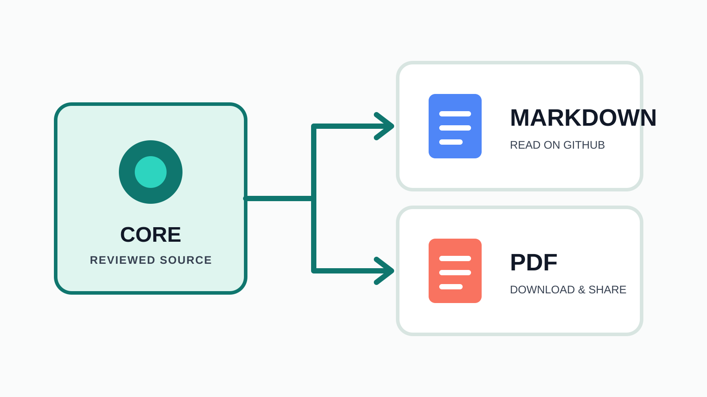
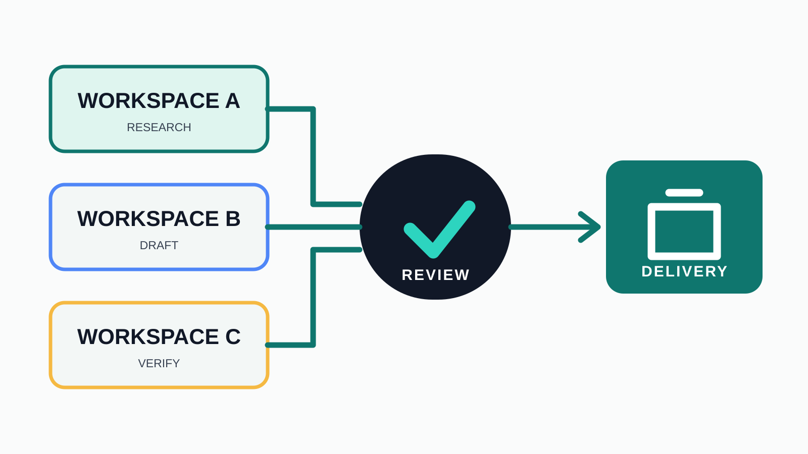

# Asset Gallery

## Publication Mark

## Backgrounds

## Explanatory Illustrations

## Icons

| Core | Workspace | Review | Delivery |
| --- | --- | --- | --- |
|  |  |  |  |

Use the manifest metadata for alt text and intended usage. Do not use an icon
as decoration when it adds no meaning.
