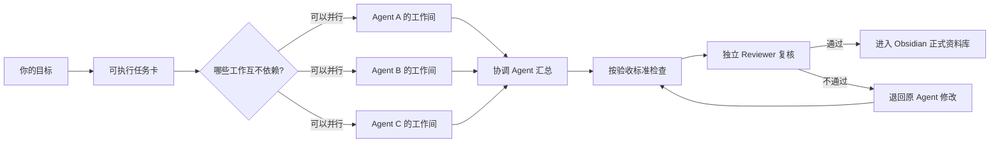
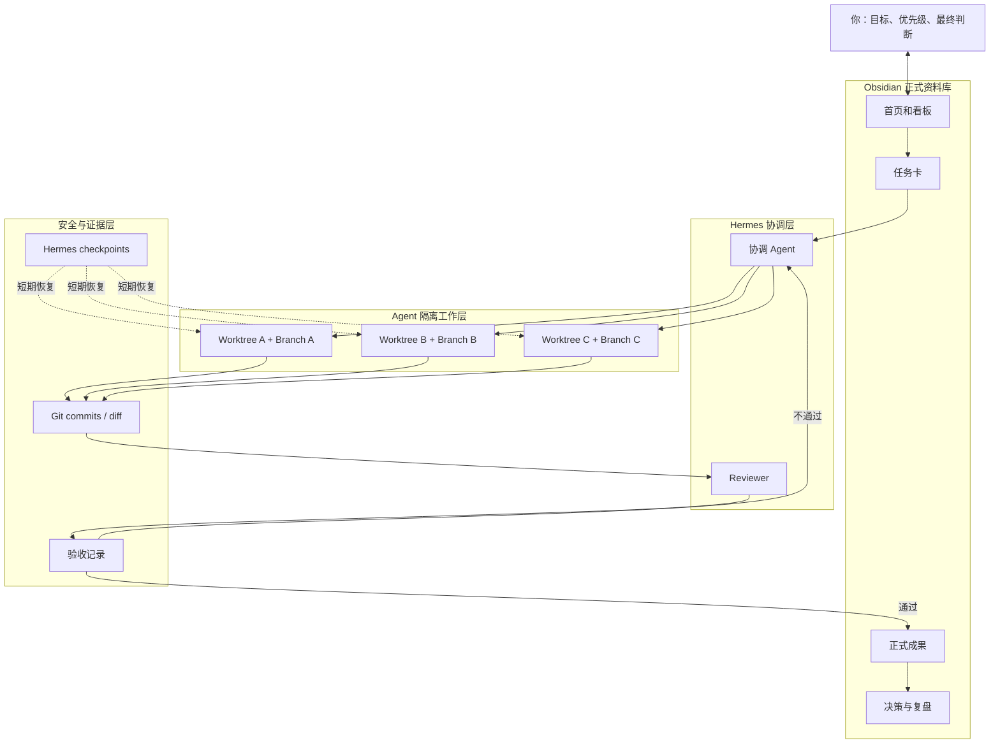
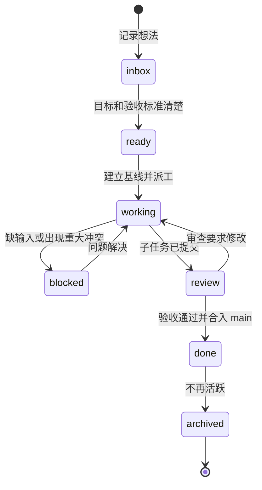
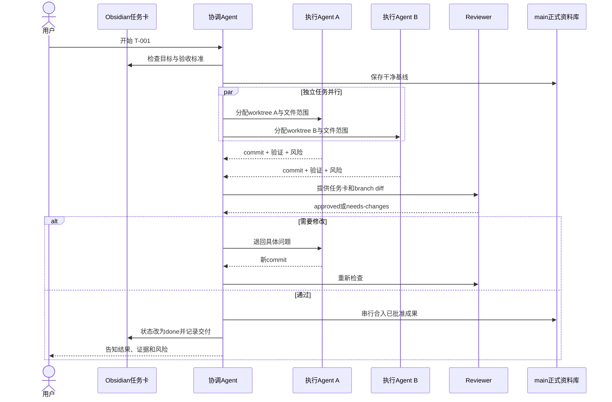
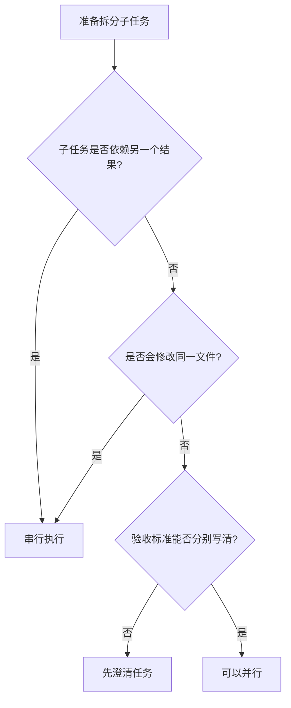
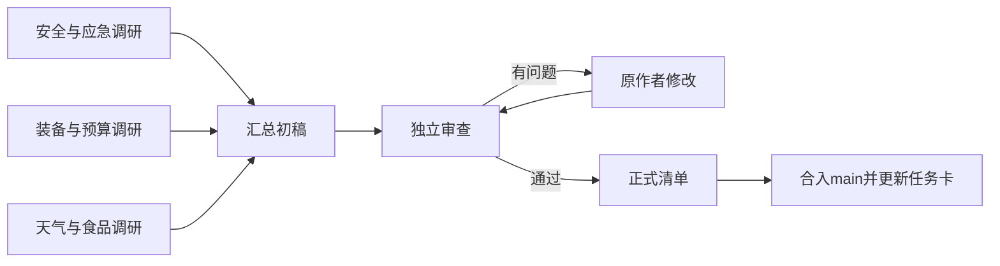
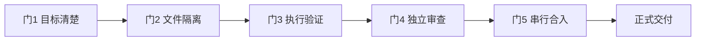
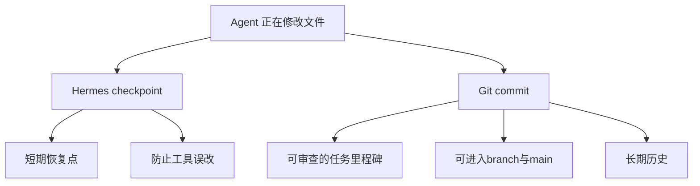
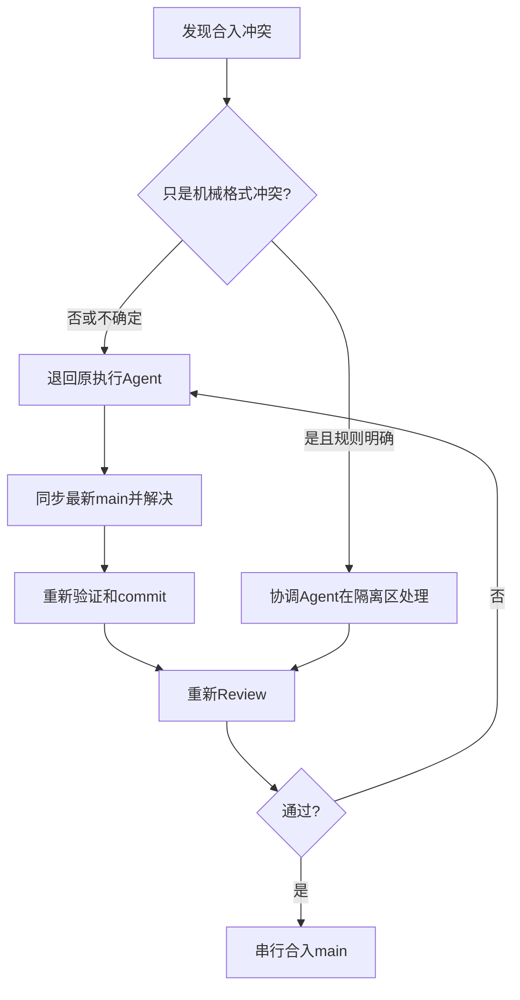
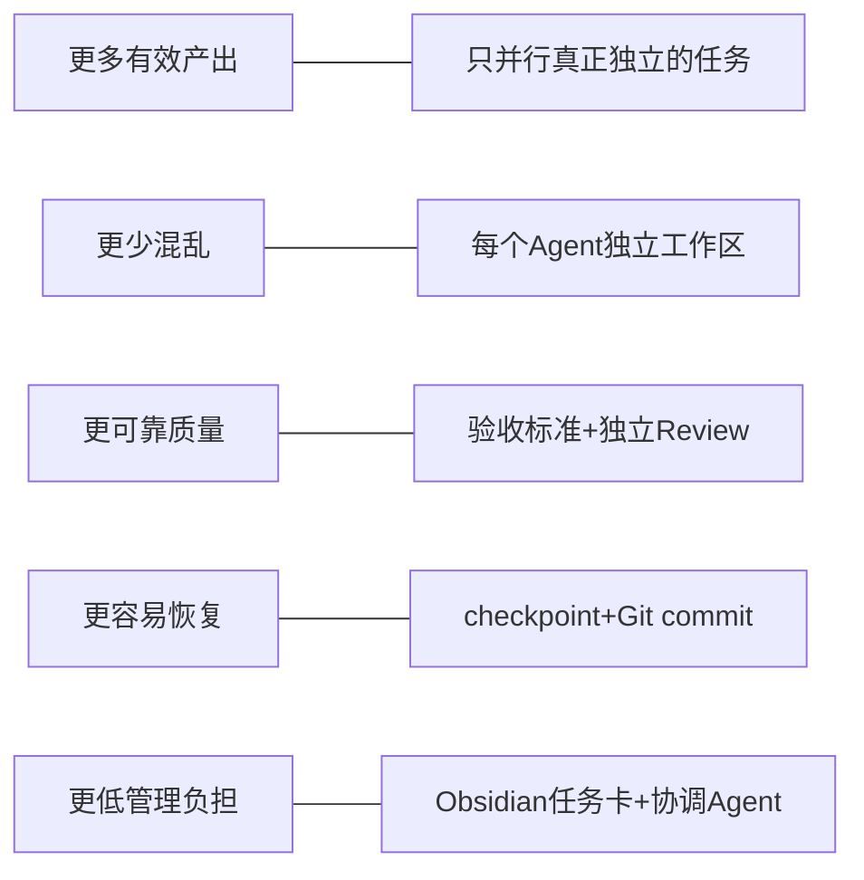

<!-- Generated from the locale core. Edit content/, not this projection. -->

> [Download PDF](https://github.com/kungfu-systems/site-kungfu-publications/releases/latest/download/atlas-lite-obsidian-hermes-multi-agent-workflow-zh-CN.pdf) · [Publication catalog](../../README.md#publications)

# 一个人带一组 AI 工作：Obsidian + Hermes Agent 的 Atlas Lite 完整教程

> 面向第一次接触多 Agent 工作流的普通用户。你不需要成为程序员，也不需要先学会 Git 的全部概念。

## 开篇：这套工作法能给你带来什么

很多人使用 AI 的方式仍然是：打开一个聊天框，提一个问题，复制一段答案，然后靠自己记住“谁做过什么、哪个版本是新的、还有什么没检查”。任务一多，AI 虽然变快了，人却变成了新的瓶颈。

这套工作法要交付的不是“多开几个聊天窗口”，而是下面五个具体价值：

| 你真正想得到的价值 | 普通聊天式使用的问题 | 这套工作法如何改善 |
| --- | --- | --- |
| 同时推进更多工作 | 一个对话做完才能开始下一个 | 把互不依赖的任务交给多个 Agent 并行处理 |
| 少返工、少互相覆盖 | 多个 Agent 同时改同一份文件容易混乱 | 每个写入 Agent 使用独立工作区和独立版本分支 |
| 知道工作是否真的完成 | “Agent 说完成了”很难核实 | 任务开始前写验收标准，完成后逐条检查 |
| 出错后能恢复 | 误删、误改后只能靠回忆或手工找旧稿 | Git 保存里程碑，Hermes checkpoint 保存短期恢复点 |
| 不再充当人工传话筒 | 人要不断复制上下文、催进度、拼结果 | 协调 Agent 负责拆分、派工、收集、审查和合并 |

最终体验应该是：

```text
你说清楚要什么
→ Hermes 帮你拆任务并派工
→ 多个 Agent 在各自工作间推进
→ 独立检查成果
→ 只有通过的内容进入 Obsidian 正式资料库
```



需要诚实说明：独立工作区能显著减少互相覆盖和现场污染，但它本身不能保证内容正确；质量来自“清楚的任务定义 + 可检查的验收标准 + 独立审查 + 可恢复的版本记录”。这套方法也不承诺任何固定倍数的提速。它首先保证并行工作不会轻易失控，然后才有资格讨论吞吐量。

### 如果你只想先跑起来

第一次阅读只做下面六件事，其余章节以后再看：

1. 按第三章安装或确认 Obsidian、Git、Hermes。
2. 把 Obsidian Vault 初始化成 Git 资料库。
3. 启用 checkpoints、三个并发子 Agent 和 worktree isolation。
4. 复制第四章的 `AGENTS.md`。
5. 完成第九章的“隔离演习”。
6. 照第八章的示例启动第一个真实任务。

做到这里，最小闭环就已经形成：

```text
任务卡 → 独立工作区 → 执行提交 → 独立检查 → 合入正式资料库
```

---

## 第一章：先用生活化比喻理解整套系统

把这套系统想象成一家小型编辑部：

| 系统组件 | 生活化角色 | 主要职责 |
| --- | --- | --- |
| 你 | 总编辑 | 决定目标、价值、优先级和高后果选择 |
| Obsidian | 编辑部资料库 | 保存任务卡、正式成果、决策和索引 |
| 主 Hermes Agent | 执行主编 | 理解任务、拆分工作、派工、追踪、收口 |
| 子 Agent | 作者、研究员、检查员 | 在明确边界内完成一项具体工作 |
| Git | 带时间刻度的保险柜 | 保存版本、比较修改、隔离工作、支持恢复 |
| Worktree | 每个 Agent 的独立工作间 | 防止多个人在同一张桌子上同时改同一份稿件 |
| Reviewer | 独立审稿人 | 不替作者写稿，只检查目标、证据、错误和遗漏 |

### 一句话心智模型

> Obsidian 管“人能看懂的工作状态”，Hermes 管“谁去做什么”，独立 worktree 管“大家不要互相踩文件”，Git 管“过程可以检查和恢复”。

### 整体架构图



---

## 第二章：你需要准备什么

### 必需品

你需要四样东西：

1. 一台 Windows、macOS 或 Linux 电脑。
2. Obsidian，用来查看和管理 Markdown 资料。
3. Hermes Agent，用来协调和执行工作。
4. Git，用来做版本记录和独立工作区。

这里的 Git 是必须的，GitHub 不是必须的。Git 可以完全在本机运行；GitHub、Gitee、NAS 或其他远端仓库只是后续备份和跨设备协作选项。

### 你暂时不需要的东西

第一天不需要安装：

- Docker；
- 数据库；
- 云服务器；
- 复杂的 Obsidian 社区插件；
- GitHub Actions；
- Atlas 完整的 Mission、Goal、marker 和多设备控制面；
- Kungfu。

先让最小闭环稳定运行，再逐步增加复杂度。

---

## 第三章：安装与一次性设置

### 第 1 步：安装 Obsidian

从 [Obsidian 官方下载页](https://obsidian.md/download) 安装桌面版。

第一次打开时：

1. 选择“创建新仓库”或“Create new vault”。
2. 名称填写 `MyAtlas`，也可以使用你喜欢的中文名称。
3. 选择一个本地文件夹，例如：

```text
macOS:  ~/Documents/MyAtlas
Windows: C:\Users\你的用户名\Documents\MyAtlas
```

这个文件夹既是 Obsidian Vault，也是后面 Git 管理的资料库。

第一次搭建时，建议先选普通本地目录，不要立刻放进 iCloud、OneDrive、Synology Drive 等自动同步目录。Hermes 原生隔离会在项目内产生 `.worktrees/` 临时工作区；`.gitignore` 只能阻止 Git 提交它，不能自动阻止其他同步软件复制它。等隔离演习通过后，再决定是让同步工具明确排除 `.worktrees/`，还是采用第十三章的外置工作区。

### 第 2 步：确认 Git 已安装

打开终端：

- macOS：打开“终端 Terminal”；
- Windows：打开 PowerShell。

输入：

```bash
git --version
```

如果能看到类似 `git version 2.x.x`，说明已经安装。

如果没有安装：

- macOS 可以运行 `xcode-select --install`；
- Windows 可以从 [Git 官方 Windows 页面](https://git-scm.com/install/windows) 安装，或在 PowerShell 运行 `winget install --id Git.Git -e --source winget`。

Git 官方安装说明也提供了 macOS、Windows 和 Linux 的不同路径：[Installing Git](https://git-scm.com/book/en/v2/Getting-Started-Installing-Git)。

### 第 3 步：设置 Git 的署名

把下面的名字和邮箱替换成你自己的：

```bash
git config --global user.name "你的名字"
git config --global user.email "你的邮箱"
git config --global init.defaultBranch main
```

这不是注册账号，只是让每次版本记录知道是谁保存的。

### 第 4 步：确认 Hermes Agent 可用

如果你已经在使用 Hermes，运行：

```bash
hermes --version
hermes doctor
```

如果还没有安装，普通用户优先使用 Hermes 官方推荐的 macOS/Windows Desktop 安装器。命令行安装方法和前置条件见 [Hermes Installation](https://hermes-agent.nousresearch.com/docs/getting-started/installation)。安装器会处理 Python、Node.js、ripgrep 等依赖；官方文档说明，非 Windows 平台的主要前置条件是 Git。

安装完成后，可以运行：

```bash
hermes setup --portal
```

也可以使用 `hermes model` 配置你已经拥有的模型服务。

### 第 5 步：把 Obsidian Vault 变成 Git 资料库

先进入 Vault。以下路径只作为示例。

macOS：

```bash
cd "$HOME/Documents/MyAtlas"
git init -b main
```

Windows PowerShell：

```powershell
cd "$HOME\Documents\MyAtlas"
git init -b main
```

此时不会上传任何资料，只是在本地建立版本管理。

### 第 6 步：启用 Hermes 的三项关键能力

在终端运行：

```bash
hermes config set checkpoints.enabled true
hermes config set delegation.max_concurrent_children 3
hermes config set delegation.worktree_isolation true
```

再检查：

```bash
hermes config get checkpoints.enabled
hermes config get delegation.max_concurrent_children
hermes config get delegation.worktree_isolation
```

这三项分别表示：

- 在 Agent 修改文件前保留短期恢复点；
- 默认最多同时运行三个子 Agent；
- 每个子 Agent 获得自己的 Git worktree 和 branch。

Hermes 当前官方文档说明，`delegation.worktree_isolation` 默认关闭；启用后，本地 Git 项目中的子 Agent 会进入独立工作区，父工作区保持不变，并在结果中返回 worktree 路径、branch、commits 和 dirty 状态。[Subagent Delegation](https://hermes-agent.nousresearch.com/docs/user-guide/features/delegation)

> 注意：这项隔离只适用于 Git 项目和本地 terminal backend。在非 Git 目录、Docker、SSH、Modal 等 backend 下，它可能退化成共享工作区，而且官方说明这种退化不一定报错。因此第一次并行写文件前必须完成本教程后面的“隔离演习”。

### 第 7 步：建立建议的 Vault 目录

在 Obsidian 中创建：

```text
MyAtlas/
├── 00_首页/
│   └── 工作台.md
├── 10_收件箱/
├── 20_任务/
├── 30_项目/
├── 40_资料/
├── 80_模板/
│   └── 任务卡模板.md
├── 90_归档/
├── AGENTS.md
└── .gitignore
```

各目录的用途：

| 目录 | 放什么 |
| --- | --- |
| `00_首页` | 当前任务、等待判断、最近交付的入口 |
| `10_收件箱` | 暂时没有整理的想法和材料 |
| `20_任务` | 每个任务一张卡，记录目标、状态、验收和结果 |
| `30_项目` | 正在形成的正式成果 |
| `40_资料` | 可复用的参考资料和证据索引 |
| `80_模板` | 任务卡、复盘、交付说明等模板 |
| `90_归档` | 已结束但需要保留的历史内容 |

在 `.gitignore` 中写入：

```gitignore
.DS_Store
Thumbs.db
.trash/
.worktrees/
.obsidian/workspace.json
.obsidian/workspace-mobile.json
```

Hermes 的原生子 Agent 隔离会把临时工作区放进项目下的 `.worktrees/`。它们是可再生的工作现场，不应提交进主资料库。如果 Obsidian 的文件树或搜索结果中出现 `.worktrees` 内的重复笔记，再到 Obsidian 设置中把 `.worktrees` 加入排除范围；不要把其中任何目录单独作为 Vault 打开。

> `.gitignore` 不是备份策略，也不是云同步排除策略。本机 Git 能恢复文件版本，但电脑磁盘损坏时仍可能一起丢失。完成最小闭环后，应给正式资料库增加一个独立备份或 Git 远端；临时 `.worktrees/` 不需要备份。

### 第 8 步：保存第一个基线版本

```bash
git add .
git commit -m "chore: 建立 MyAtlas 初始资料库"
```

检查：

```bash
git status
```

看到 `working tree clean`，说明最初版本已经安全保存。

---

## 第四章：把工作规则交给 Hermes

Hermes 会在项目启动时读取 `AGENTS.md`，用它理解项目结构、约定和工作流。官方文档将 `AGENTS.md` 定义为项目级上下文文件；修改后应重启会话，让新规则进入下一次会话上下文。[Which File Does What?](https://hermes-agent.nousresearch.com/docs/user-guide/which-file-does-what)

把下面内容复制到 Vault 根目录的 `AGENTS.md`。

```markdown
# MyAtlas 多 Agent 工作规则

## 目标

这个资料库使用 Obsidian 管理人类可读的任务与正式成果，使用 Hermes Agent 协调工作，使用 Git 保存版本并隔离多个 Agent。

## 用户交互

- 默认使用中文和用户交流。
- 用普通语言解释状态，不要求用户理解 Git 术语。
- 用户只需要使用：记录、开始、检查、交付、暂停、恢复。
- 只有目标、价值取舍或高风险决定不清楚时才询问用户。

## 主资料库

- 当前 Vault 的 main 分支代表已经接受的正式状态。
- 执行 Agent 不直接在 main 工作区修改正式成果。
- 开始任务前先检查 Git 状态；如果存在未保存修改，先向用户说明并保存基线版本。
- 只有协调 Agent 可以在检查通过后把成果合入 main。

## 任务卡

- 所有需要写文件的工作，先在 `20_任务/` 建立任务卡。
- 任务卡至少包含：目标、交付物、非目标、验收标准、状态、负责人和结果。
- 状态只能使用：inbox、ready、working、review、blocked、done、archived。
- checkpoint 只表示可以恢复，不表示完成。

## 独立工作区

- 每个需要写文件的子 Agent 必须拥有独立 Git worktree 和独立 branch。
- 默认启用 `delegation.worktree_isolation: true`。
- 不允许两个 Agent 共用一个 worktree 或 branch。
- 并行 Agent 必须修改不同文件或不同目录；如果必须修改同一文件，则改为串行执行。
- 派工时必须提供：任务编号、目标、输入、允许修改路径、禁止修改路径、验收标准和依赖。
- 子 Agent 只提交自己 branch 的成果，不合并 main，不删除 worktree，不使用 force/reset/clean。
- 子 Agent 完成时必须报告：修改文件、commit、验证、风险和未完成项。

## 并行原则

- 只有互不依赖、文件所有权不重叠的工作才并行。
- 默认最多同时运行三个子 Agent。
- 调研、列清单、检查、独立方案比较适合并行。
- 同一篇终稿的连续改写、依赖上一步结果的工作、涉及同一核心文件的任务必须串行。

## 审查

- 执行者不能作为自己成果的唯一 Reviewer。
- Reviewer 依据任务卡、branch diff、来源和验收标准检查。
- Reviewer 默认不直接改执行者 branch；发现问题时给出具体文件、问题、严重度和建议。
- 不通过的成果退回原执行 Agent 修改，再重新审查。

## 合入与交付

- 协调 Agent 逐个检查 branch 的 commits、dirty 状态、diff 和验收结果。
- 只有工作区 clean、成果已 commit、验收通过、Reviewer 无阻断问题时才能合入 main。
- 多个 branch 的合入必须串行进行。
- 发生语义冲突时停止合入，退回原 Agent 处理；不要在 main 上猜测解决。
- 合入后更新任务卡结果和正式成果入口。
- 只有确认 branch 已合入且 worktree clean 时，才允许使用非 force 方式清理临时 worktree。

## 安全

- 不删除、覆盖或批量移动用户原始资料，除非用户明确要求。
- 不读取或输出密钥、token、私密配置。
- 不把 Agent 自己的临时分析写进正式成果。
- 无法证明 worktree 已隔离时，不允许多个 Agent 并行写文件。
- 无法证明成果已合入或工作区 clean 时，保留现场并报告，不强制删除。
```

保存 `AGENTS.md` 后，提交规则并重新启动 Hermes：

```bash
git add AGENTS.md .gitignore
git commit -m "docs: 建立多 Agent 协作规则"
hermes
```

---

## 第五章：任务卡是整套工作法的起点

没有任务卡，多 Agent 只是更快地产生更多不确定内容。任务卡负责把“我想要点什么”变成“完成后可以检查什么”。

把下面模板保存到 `80_模板/任务卡模板.md`：

```markdown
---
task_id: T-YYYYMMDD-001
status: inbox
priority: medium
owner: coordinator
created: YYYY-MM-DD
depends_on: []
branches: []
worktrees: []
---

# 任务名称

## 为什么做

这件事最终要帮助谁解决什么问题？

## 目标

用一句话描述完成后的结果。

## 交付物

- [ ] 需要出现的文件或结果 1
- [ ] 需要出现的文件或结果 2

## 不做什么

- 本次明确不处理的范围

## 验收标准

- [ ] 内容覆盖目标用户真正关心的问题
- [ ] 重要事实有来源或明确标注为推断
- [ ] 没有明显遗漏、重复和自相矛盾
- [ ] 文件位于约定目录，命名清楚
- [ ] 独立 Reviewer 已检查

## 分工

| 子任务 | Agent | 允许修改路径 | 依赖 | 状态 |
| --- | --- | --- | --- | --- |
| 待拆分 | 待定 | 待定 | 无 | ready |

## 进展

- YYYY-MM-DD：任务建立

## 审查结果

等待审查。

## 最终交付

等待交付。
```

### 好任务和坏任务的区别

坏任务：

> 帮我研究一下露营。

好任务：

> 为第一次带 6—10 岁孩子露营的家庭制作一份两天一夜装备清单；预算分为 1000 元和 3000 元两档；必须包含安全、天气、食品和应急检查；最终交付一个可打印 Markdown 清单，所有价格只标注为调研时点参考。

后者更容易拆分，也更容易判断是否完成。

---

## 第六章：普通用户每天只需要六个口令

### 1. 记录

你说：

> 记录：以后想做一个家庭露营装备清单，现在先不要开始。

Hermes 应该：

- 在 `10_收件箱/` 或 `20_任务/` 建立记录；
- 状态设为 `inbox`；
- 不派 Agent，不开始长时间工作。

### 2. 开始

你说：

> 开始 T-20260825-001。

Hermes 应该：

1. 检查目标和验收标准；
2. 保存当前主资料库基线；
3. 判断哪些子任务可以并行；
4. 给每个写入 Agent 分配独立 worktree、branch 和文件所有权；
5. 开始执行并更新任务状态。

### 3. 检查

你说：

> 检查 T-20260825-001，现在有什么问题？

Hermes 应该：

- 展示完成项、未完成项和阻塞；
- 对照验收标准；
- 让独立 Reviewer 检查 branch diff；
- 不因为“文件已经生成”就宣告完成。

### 4. 交付

你说：

> 交付 T-20260825-001。

Hermes 应该：

1. 确认所有必要成果已 commit；
2. 确认独立审查通过；
3. 串行合入 main；
4. 更新任务卡和正式成果入口；
5. 保存最终版本；
6. 安全清理已经合入且 clean 的临时工作区；
7. 用普通语言告诉你交付在哪里、还有什么风险。

### 5. 暂停

你说：

> 暂停 T-20260825-001，保留现场。

Hermes 应该保存 checkpoint 或 commit，记录恢复入口，不把半成品合入 main，也不清理工作区。

### 6. 恢复

你说：

> 恢复 T-20260825-001，从上次断点继续。

Hermes 应该先读取任务卡、最近 commit、checkpoint 和当前 worktree 状态，再继续工作，而不是靠聊天记忆猜测。

---

## 第七章：一次完整任务在后台如何运行

### 任务生命周期



### 用户、协调 Agent 和子 Agent 的协作顺序



### 哪些工作适合并行



适合并行：

- 分别调研不同主题；
- 分别比较不同方案；
- 一个 Agent 查事实，另一个 Agent 检查结构；
- 分别处理不同文件或不同章节；
- 执行完成后由另一个 Agent 做独立审查。

不适合并行：

- 两个 Agent 同时重写同一篇终稿；
- 后一步必须读取前一步的结果；
- 任务目标仍然含糊；
- 多个 Agent 会共同修改同一个索引或任务卡；
- 涉及付款、公开发布、删除原始资料等高后果动作。

初学阶段，当 Agent 正在处理某个项目时，用户最好只阅读该项目文件，不要同时修改同一批文件。如果临时需要手工修改，先告诉协调 Agent；交付前把这些人工修改单独保存为 commit，再继续审查和合入。这样可以区分“人改的内容”和“Agent 改的内容”。

---

## 第八章：第一次实战——家庭露营装备清单

### 你只需要这样说

> 开始一个新任务：为第一次带 6—10 岁孩子露营的家庭制作一份两天一夜装备清单。预算分为 1000 元和 3000 元两档；必须覆盖安全、天气、食品和应急；价格注明调研日期，只作为参考。请先建立任务卡，判断哪些部分可以并行，每个写入 Agent 使用独立工作区，完成后安排独立 Reviewer，检查通过后再交付到 `30_项目/家庭露营/`。

### 协调 Agent 应拆成什么样

| 子任务 | 输出文件 | 是否并行 | 原因 |
| --- | --- | --- | --- |
| 安全与应急调研 | `资料-安全与应急.md` | 是 | 文件独立 |
| 装备与预算调研 | `资料-装备与预算.md` | 是 | 文件独立 |
| 天气与食品调研 | `资料-天气与食品.md` | 是 | 文件独立 |
| 汇总成初稿 | `初稿.md` | 否 | 依赖三份调研 |
| 独立审查 | 审查意见写入任务卡 | 否 | 依赖初稿完成 |
| 形成正式清单 | `家庭露营装备清单.md` | 否 | 依赖审查结果 |

### 这个任务的依赖图



三个调研 Agent 可以同时工作，但初稿、审查和终稿必须依次进行。多 Agent 的价值不是“所有步骤都并行”，而是只把真正独立的部分并行化。

---

## 第九章：第一次一定要做的“隔离演习”

不要直接拿重要项目测试多 Agent。先让 Hermes 完成一个十分钟演习。

对 Hermes 说：

> 做一次多 Agent 隔离演习。建立任务卡 `T-ISOLATION-001`。派两个子 Agent：A 只能创建 `30_项目/隔离演习/A.md`，内容写“A 的独立成果”；B 只能创建 `30_项目/隔离演习/B.md`，内容写“B 的独立成果”。两者必须使用独立 worktree 和 branch，分别 commit。完成后先不要合并，向我报告每个 worktree 的 path、branch、commits 和 dirty 状态。

你应该看到类似：

```text
Agent A
  path: .../.worktrees/subagent-...
  branch: hermes-subagent/subagent-...
  commits: 1
  dirty: false

Agent B
  path: .../.worktrees/subagent-...
  branch: hermes-subagent/subagent-...
  commits: 1
  dirty: false
```

还可以让 Hermes 运行只读检查：

```bash
git worktree list
git branch --list 'hermes-subagent/*'
git status --short
```

通过标准：

- 两个 Agent 的 worktree 路径不同；
- 两个 branch 不同；
- 每个 Agent 只创建自己被允许的文件；
- 两个工作区都已 commit 且 `dirty: false`；
- 主资料库在合入前没有出现 A.md 和 B.md；
- 合入后两个文件才进入 main。

如果结果中没有 worktree 字段，或者两个 Agent 使用了同一个目录，说明隔离没有真正生效。此时不要并行写重要文件，先检查：

1. 当前 Vault 是否已经 `git init`；
2. `delegation.worktree_isolation` 是否为 `true`；
3. Hermes terminal backend 是否为 local；
4. 会话是否在 Vault 的 Git 根目录启动；
5. Hermes 版本是否支持该功能。

---

## 第十章：质量不是最后看一眼，而是五道门



### 门 1：目标清楚

检查：

- 为谁做？
- 最终交付什么？
- 什么不在范围内？
- 怎样算完成？

### 门 2：文件隔离

检查：

- 每个写入 Agent 是否有独立 worktree 和 branch？
- 并行 Agent 的允许修改路径是否重叠？
- 主资料库是否仍然干净？

### 门 3：执行者自验

执行 Agent 必须报告：

- 改了哪些文件；
- 为什么这样改；
- 做了什么检查；
- 还有哪些不确定性；
- 对应 commit 是什么。

### 门 4：独立审查

Reviewer 至少回答：

1. 交付物是否齐全？
2. 是否逐条满足验收标准？
3. 事实和来源是否匹配？
4. 是否存在遗漏、矛盾、过度推断？
5. 修改范围是否越界？
6. 是否可以进入 main？

审查结论只使用：

```text
approved       可以合入
needs-changes  必须修改后重审
needs-decision 需要用户做价值或风险判断
```

### 门 5：串行合入

即使三个 Agent 同时完成，合入 main 也要一个一个进行：

```text
检查 A → 合入 A → 再检查当前 main
检查 B → 合入 B → 再检查当前 main
检查 C → 合入 C → 最终验收
```

并行发生在草稿区，正式状态的改变必须串行。这样每一步都能追踪，也能在某一步失败时停止。

---

## 第十一章：Git commit 和 Hermes checkpoint 有什么区别



简单理解：

- checkpoint 像编辑软件的自动保存；
- commit 像给一个完整阶段正式编号归档；
- branch 像一个独立版本路线；
- main 像已经批准的正式版本。

Hermes checkpoint 当前默认是关闭的，需要显式启用；它使用 Hermes 自己的 shadow Git store，不会修改项目的 `.git`。官方建议把 checkpoint 与 Git worktree 结合使用。[Checkpoints and `/rollback`](https://hermes-agent.nousresearch.com/docs/user-guide/checkpoints-and-rollback)

需要恢复时，先预览：

```text
/rollback
/rollback diff 1
```

确认后再恢复。不要把 checkpoint 当作“工作已经完成”的证明。

---

## 第十二章：遇到问题时怎么办

### 情况 1：两个 Agent 改了同一文件

不要让协调 Agent随便拼接。正确处理：

1. 停止合入；
2. 判断谁拥有该文件；
3. 让原负责 Agent 读取另一个方案并重新形成单一版本；
4. 重新 commit；
5. 再做独立审查。

### 情况 2：子 Agent 结束时还有未提交修改

`dirty: true` 不等于成果丢失，但说明还不能交付。保留 worktree，让原 Agent检查并 commit，或明确记录为什么不能保存。不要强制清理。

### 情况 3：Hermes 没有创建独立 worktree

立即退回单 Agent 串行模式。不要在共享工作区启动多个写入 Agent。按“隔离演习”的五项检查逐一排查。

### 情况 4：Reviewer 和执行 Agent 意见不同

让 Reviewer 指向具体文件、验收条目和证据。能用证据解决的就用证据；涉及价值、风格或风险偏好的，状态设为 `needs-decision`，交给用户决定。

### 情况 5：合入出现冲突



原则是：不要在正式 main 上一边冲突一边猜测。

### 情况 6：想删除旧工作区

只有同时满足以下条件才能清理：

- branch 已经合入 main；
- worktree 是 clean；
- 没有未保存成果；
- Git 能用非 force 方式删除。

如果任何一项无法证明，保留现场并报告。Hermes 官方的 worktree 指南也指出，`git worktree remove` 默认会拒绝删除含未提交修改的工作区。[Git Worktrees](https://hermes-agent.nousresearch.com/docs/user-guide/git-worktrees)

---

## 第十三章：由浅入深的四阶段采用路线

### 阶段 1：一个 Agent + 任务卡

建议时间：最初 2—3 天。

只使用一个 Hermes Agent，训练自己把目标、交付物和验收标准写清楚。开启 Git 和 checkpoints，但不做并行。

成功标志：

- 每个任务都有卡；
- 能找到最终成果；
- 能恢复错误修改；
- 不再只靠聊天记录记进度。

### 阶段 2：两个 Agent + 独立文件

只并行最安全的任务，例如两份独立调研。先完成隔离演习。

成功标志：

- 两个 worktree 和 branch 可见；
- 文件所有权不重叠；
- main 在合入前不被污染；
- 合入后结果完整。

### 阶段 3：三个 Agent + 独立 Reviewer

加入“执行者不能自我验收”的规则。最多三个并发子 Agent，不追求更多。

成功标志：

- Reviewer 能指出具体问题而非泛泛评价；
- needs-changes 会退回原 Agent；
- 未通过的成果不会进入 main。

### 阶段 4：外置工作区和远端备份

当项目变大、`.worktrees/` 占用明显，或你需要多设备协作时，再升级：

- 把长期 worktree 统一放到 Vault 外部的 `~/AgentWork/` 或 `~/Worktrees/`；
- 使用 GitHub、Gitee、NAS 或私有 Git 远端备份 commits；
- 增加项目看板、长期目标和自动 closeout；
- 为重复流程制作 Hermes skill 或脚本。

外置布局示例：

```text
~/Documents/MyAtlas/                    # Obsidian 只打开这里
~/AgentWork/MyAtlas/T-001/research-a/   # Agent A
~/AgentWork/MyAtlas/T-001/research-b/   # Agent B
~/AgentWork/MyAtlas/T-001/review/       # Reviewer
```

这一阶段属于进阶配置。Hermes 原生 `worktree_isolation` 当前固定使用项目内 `.worktrees/`；外置布局通常需要协调 Agent 显式运行 `git worktree add`，或为你的环境增加一个受控脚本。第一周不必处理。

---

## 第十四章：工作台应该显示什么

`00_首页/工作台.md` 不需要变成复杂数据库。最小版本只显示四块：

```markdown
# 工作台

## 正在做

- [[T-20260825-001 家庭露营装备清单]]

## 等我决定

- 暂无

## 等待审查

- 暂无

## 最近交付

- [[家庭露营装备清单]]
```

用户真正需要看到的是：

```text
现在在做什么
谁在做
卡在哪里
需要我决定什么
最后交付在哪里
```

branch、commit、worktree path 等技术信息可以放在任务卡 frontmatter 或“技术记录”折叠段落中，不必占据首页。

---

## 第十五章：如何判断这套方法是否真的对你有价值

不要只数“启动了多少 Agent”，要看下面这些现实信号：

### 每周回答五个问题

1. 本周完成了多少个有明确交付物的任务？
2. 有多少成果因为验收或 Review 被及时退回，而不是带着问题进入正式资料库？
3. 有多少次 Agent 互相覆盖文件？理想答案应接近零。
4. 任务中断后，是否能在十分钟内找到断点并恢复？
5. 你花在复制上下文、追问进度和人工拼结果上的时间是否减少？

### 一个简单的人工记录表

| 周次 | 完成任务 | 返工任务 | 文件碰撞 | 可恢复中断 | 人工协调时间 | 备注 |
| --- | ---: | ---: | ---: | ---: | ---: | --- |
| 第 1 周 |  |  |  |  |  |  |
| 第 2 周 |  |  |  |  |  |  |
| 第 3 周 |  |  |  |  |  |  |

如果完成任务增加，但返工、碰撞和人工协调时间也同时暴涨，说明只是“开了更多 Agent”，还没有形成工作系统。先减少并发、缩小任务、明确文件所有权和验收标准。

---

## 第十六章：最终检查清单

### 一次性安装完成

- [ ] Obsidian 已安装并能打开 MyAtlas Vault
- [ ] `git --version` 正常
- [ ] `hermes --version` 和 `hermes doctor` 正常
- [ ] Vault 已执行 `git init -b main`
- [ ] Git 署名已设置
- [ ] Hermes checkpoints 已启用
- [ ] Hermes worktree isolation 已启用
- [ ] `AGENTS.md` 已创建并在新会话中加载
- [ ] `.worktrees/` 已加入 `.gitignore`
- [ ] 初始 commit 已保存

### 第一次并行前

- [ ] 已完成隔离演习
- [ ] 每个子 Agent 的 worktree 不同
- [ ] 每个子 Agent 的 branch 不同
- [ ] 并行 Agent 不修改同一文件
- [ ] 主资料库在合入前保持不变

### 每次交付前

- [ ] 任务目标和交付物齐全
- [ ] 验收标准逐条通过
- [ ] 所有成果已 commit
- [ ] 所有成果工作区为 clean
- [ ] Reviewer 独立检查通过
- [ ] 合入过程串行完成
- [ ] 任务卡已更新为 done
- [ ] 用户知道正式成果在哪里
- [ ] 剩余风险已经说明

---

## 结尾：开篇承诺的价值是怎样被交付的

回到开篇的五个价值，这套工作法不是靠一句“相信 Agent”来兑现，而是由一组可以看见、检查和恢复的机制来交付：

| 开篇承诺的价值 | 实际交付机制 | 你能看到的证据 |
| --- | --- | --- |
| 同时推进更多工作 | 协调 Agent 拆分独立子任务，最多三个子 Agent 并行 | 任务卡分工、多个独立 worktree 和 branch |
| 少返工、少互相覆盖 | 一个写入 Agent 对应一个工作间，文件所有权不重叠 | 不同 worktree path、不同 branch、清晰 diff |
| 知道是否真的完成 | 先写验收标准，再由独立 Reviewer 检查 | checklist、review 结论、needs-changes 记录 |
| 出错后能恢复 | checkpoint 保存短期现场，commit 保存长期里程碑 | `/rollback`、Git history、可保留的 dirty worktree |
| 不再充当人工传话筒 | Obsidian 保存任务状态，协调 Agent 负责派工和收口 | 工作台、任务卡、最终交付链接和风险说明 |



最终，你交给系统的不是一句模糊要求，而是一张可以执行和验收的任务卡；系统交还给你的也不只是一段看起来不错的回答，而是一份经过隔离生产、版本保存、独立检查并正式归档的成果。

这就是 Atlas Lite 的核心：

> 人负责方向和判断，Agent 负责并行执行，流程负责不让速度破坏质量。

---

## 官方资料

- [Hermes Agent 安装](https://hermes-agent.nousresearch.com/docs/getting-started/installation)
- [Hermes 子 Agent Delegation 与 Worktree Isolation](https://hermes-agent.nousresearch.com/docs/user-guide/features/delegation)
- [Hermes Git Worktrees](https://hermes-agent.nousresearch.com/docs/user-guide/git-worktrees)
- [Hermes Checkpoints 与 Rollback](https://hermes-agent.nousresearch.com/docs/user-guide/checkpoints-and-rollback)
- [Hermes 项目上下文文件说明](https://hermes-agent.nousresearch.com/docs/user-guide/which-file-does-what)
- [Git 官方安装说明](https://git-scm.com/book/en/v2/Getting-Started-Installing-Git)
- [Obsidian 官方下载](https://obsidian.md/download)
